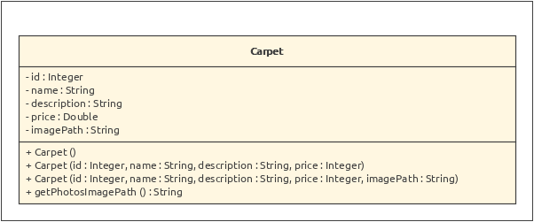

# Silky Road 🐪
## Silky Road 
Dans le cadre de notre cours d'AMT, nous réalisons un **site d'e-commerce** de vente de tapis (😉).
Avant de contribuer, nous vous recommandons de commencer par le lire le [**Wiki (si vous êtes assistant, cliquez ici)**](../../wiki) qui vous donnera une bonne vision du produit, de comment contribuer ainsi que des détails technologiques et techniques utiles à une bonne collaboration 🔥

## Structure
- Le dossier `src` contiens le code source du projet.
- Le dossier `docs` contiens tous les éléments utiles à la documentation (fichiers sources, images).
- Le dossier `docker` contiens les images Docker. Chaque image différente est dans un sous-dosseier (exemple: une image Docker `couchebase` serait dans `docker/docker-couchebase`).

## Commencer 🏁
Cette section a pour but de mettre en place un **environnement de développement** similaire à celui de l'équipe de développement.
Pour en savoir plus sur la stack technologique, référez-vous à la section [choix technologique](../../wiki/Choix-technologiques) du Wiki !
### Prérequis
- [Java](https://www.java.com/fr/download/) : *1.8*
- [Maven](https://maven.apache.org/download.cgi) :  *3.8.**
- [Docker engine](https://docs.docker.com/engine/install/) : *20.10.**
- [Docker compose](https://docs.docker.com/compose/install/) 
  - *NOTE: docker compose est inclus dans les installation de l'engine sur Windows et MacOS*.
- [IntelliJ IDEA](https://www.jetbrains.com/idea/download/)

### Installation 
1. Cloner le repository.
```bash 
git clone git@github.com:EricB2A/PRO_AMT.git
```
2. Ouvrir le projet avec IntelliJ
3. Lancer le conteneur Docker
```bash
cd docker/docker-mysql && touch silkyRoad.sql && docker compose up
```
4. Lancer Spring boot et le Tomcat Server *(^R)*.
5. Allez à l'adresse [localhost:8080](http://localhost:8080/) et vous voilà prêt à contribuer :cool:. 

## SGBD 🐋
Notre application utilise le SGBD `mySQL`, que nous avons Dockerisé via l'image [mysql-server](https://hub.docker.com/r/mysql/mysql-server/).
Par défaut, le conteneur Docker sera accessible sur le ``port 3307`` avec le mot de passe ``root``. Les données sont es stockés dans le fichier `silkyRoad.sql`.  
Vous pouvez bien évidemment configurer ces paramètres en modifiant le [docker compose](docker/docker-mysql/docker-compose.yml).

Pour accéder à l'instance mySQL *(en ayant un container up & running)* : 
```bash
docker exec -it docker-mysql_db_1 bash
mysql -uroot -proot
```

## Modèle de domaine 💡


L'ORM [Hibernate](https://hibernate.org/) va faire un mapping 1-1 entre ce(s) classe(s) et ses(leurs) attributs et une table éponyme et ses champs associés en base de données.

## Routes 👀
| Verbe HTTP | Route               | Contrôleur            |
|------------|---------------------|-----------------------|
| GE`        | `/accueil`          | `HomeController`      |
| GET        | `/carpets`          | `CarpetController`    |
| POST       | `/carpets`          | `CarpetController`    |
| GET        | `/carpets/new`      | `CarpetController`    |
| GET        | `/carpets/{id}`     | `CarpetController`    |
| DELETE     | `/carpets/{id}`     | `CarpetController`    |
| GET        | `/api/carpets`      | `CarperControllerAPI` |
| POST       | `/api/carpets`      | `CarperControllerAPI` |
| GET        | `/api/carpets/{id}` | `CarperControllerAPI` |
| PUT        | `/api/carpets/{id}` | `CarperControllerAPI` |
| DELETE     | `/api/carpets/{id}` | `CarperControllerAPI` |

## L'équipe 🦍
| Développeur       | Github                                                  |
|-------------------|---------------------------------------------------------|
| Eric Bousbaa      | [EricB2A](https://github.com/EricB2A)                   |
| Ilias Goujgali    | [Double-i](https://github.com/Double-i)                 |
| Noah Fusi         | [noahfusi](https://github.com/noahfusi)                 |
| Dalia Maillefer   | [AliceThunderWind](https://github.com/AliceThunderWind) |
| Stéfan Teofanovic | [OvichHeigVD](https://github.com/OvichHeigVD)           |

### Discord
Vous êtes les bienvenus à nous rejoindre sur [Discord](https://discord.gg/bwNER8rU) où nous organisons des sessions de travail hebdomadaires.

Bonne contribution 😎
